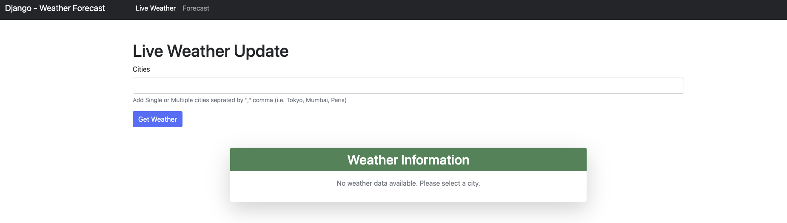

# Fluid-Structure-Task

Real Time Weather Forecast and Historical data Insight

## Project Screenshot




## Installation

Follow these steps to set up and run the project:

1. **Clone the repository:**

    ```bash
    git clone https://github.com/your-username/Fluid-Structure-Task
    ```

2. **Navigate to the project directory:**

    ```bash
    cd Fluid-Structure-Task
    ```

3. **Create a virtual environment:**

    ```bash
    python -m venv venv
    ```

4. **Activate the virtual environment:**

    - On Windows:

        ```bash
        venv\Scripts\activate
        ```

    - On macOS/Linux:

        ```bash
        source venv/bin/activate
        ```

5. **Install project dependencies:**

    ```bash
    pip install -r requirements.txt
    ```

6. **Apply database migrations:**

    ```bash
    python manage.py migrate
    ```

7. **Run the development server:**

    ```bash
    python manage.py runserver
    ```

The development server will start, and you can access the application at `http://127.0.0.1:8000/`.

## Usage

- Real-Time weather you can access on root endpoint http://127.0.0.1:8000/
- 24 hr weather Forecast you can access on root endpoint http://127.0.0.1:8000/forecast


